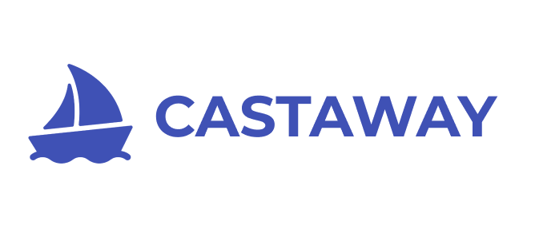
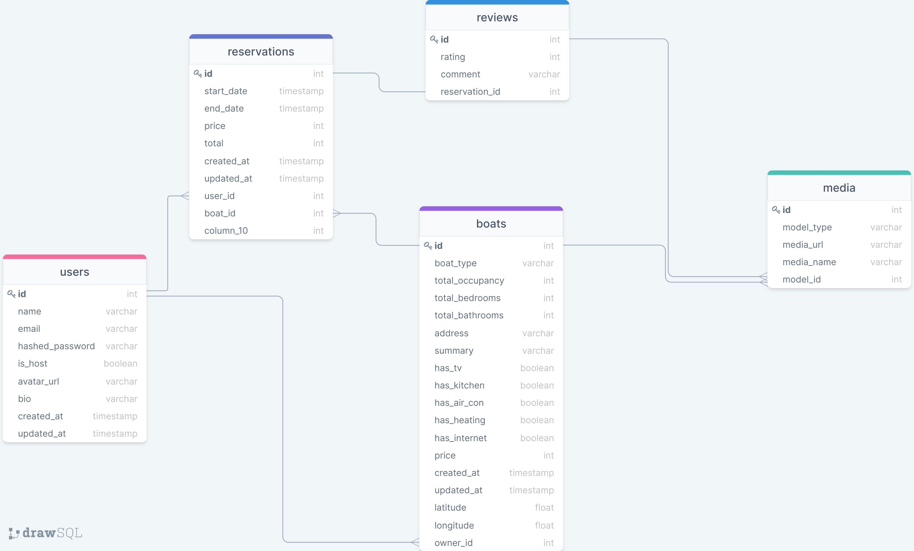

 
Castaway is a simple yet powerful boat rental platform that allows users to find boat listings near them to rent for a certain number of days. It leverages Google's Locational Services and APIs to power search and maps.

## Demo

Here is a working live demo: [Demo](https://castaway-app.herokuapp.com/)

## Dependencies

#### Backend

-   Flask
-   SQLAlchemy
-   WTForms
-   Flask Login
-   Flask JWT
-   Werkzeug
-   Psycopg2

#### Frontend

-   React
-   Material UI
-   Styled Components
-   Moment
-   Google Maps React
-   Use Places Autocomplete
-   React Particles
-   React Spring
-   HTTP Proxy Middleware

## Application Architecture

Castaway's backend was built using Flask for Python. The server has a RESTful API layer for all CRUD actions. It is connected to a PostgreSQL database which leverages the SQLAlchemy ORM for information retrieval and data manipulation. The frontend was built using React and Hooks, and uses built-in context for client storage and global state management. All ougoing client requests are proxied to Flask server.

## Features

### Minimum Viable Product

-   Authentication
-   Boat Listings with Map
-   Reservations
-   Location Search
-   Likes

### Future Features

-   Host Dashboard
-   Reviews
-   Availability check for reservations
-   Boat Retrieval Algorithm
-   Messaging

## Database Schema

## API Routes

### Backend Routes

#### Auth API

| Endpoint               | HTTP Verb |                                Description |
| :--------------------- | :-------: | -----------------------------------------: |
| /api/auth              |    GET    |                          Authenticate User |
| /api/auth/login        |   POST    |                             Logs a user In |
| /api/auth/logout       |    GET    |                            Logs a user out |
| /api/auth/signup       |   POST    |        Creates a new user and logs them in |
| /api/auth/unauthorized |    GET    | Returns unauthorized JSON when failed auth |

#### Users API

| Endpoint                    | HTTP Verb |                           Description |
| :-------------------------- | :-------: | ------------------------------------: |
| /api/users/:id              |    GET    |                      Gets single user |
| /api/users/:id/reservations |    GET    | Gets all reservations for single user |

#### Boats API

| Endpoint                    | HTTP Verb |                  Description |
| :-------------------------- | :-------: | ---------------------------: |
| /api/boats                  |    GET    |               Gets all boats |
| /api/boats/:id              |    GET    |             Gets single boat |
| /api/boats/:id              |   POST    |           Create single boat |
| /api/boats/:id              |   PATCH   |           Edit a single boat |
| /api/boats/:id              |  DELETE   |         Delete a single boat |
| /api/boats/:id/reservations |   POST    | Creates Reservation for Boat |

#### Reservations API

| Endpoint              | HTTP Verb |        Description |
| :-------------------- | :-------: | -----------------: |
| /api/reservations/:id |  DELETE   | Delete reservation |
