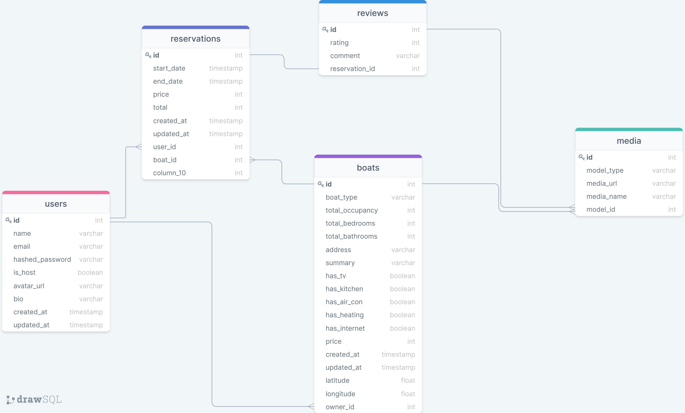

# Sailbnb

Airbnb inspired Boat Renting Site

### MVP

-   Authentication
-   Boats (Spots)
-   Reservations
-   Boat Search
-   Reviews

### Bonus Features

-   Messaging
-   User/Host Profiles

### Database Schema

### Technologies being used

-   Flask
-   SQLAlchemy
-   Flask WTF
-   React
-   Redux
-   JWT
-   Bcrypt
-   Bootstrap

### Routes

#### Backend Routes

##### Auth API

| Endpoint               | HTTP Verb |                                Description |
| :--------------------- | :-------: | -----------------------------------------: |
| /api/auth              |    GET    |                          Authenticate User |
| /api/auth/login        |   POST    |                             Logs a user In |
| /api/auth/logout       |    GET    |                            Logs a user out |
| /api/auth/signup       |   POST    |        Creates a new user and logs them in |
| /api/auth/unauthorized |    GET    | Returns unauthorized JSON when failed auth |

#### Users API

| Endpoint                    | HTTP Verb |                                    Description |
| :-------------------------- | :-------: | ---------------------------------------------: |
| /api/users                  |    GET    |                                 Gets all users |
| /api/users/:id              |    GET    |                               Gets single user |
| /api/users/:id              |   PATCH   |                            Edits a single user |
| /api/users/:id/boats        |    GET    |                    Gets all boats for one user |
| /api/users/:id/reservations |    GET    |          Gets all reservations for single user |
| /api/users/:id/reviews      |    GET    | Gets all reviews for single users reservations |

#### Boats API

| Endpoint                    | HTTP Verb |                                     Description |
| :-------------------------- | :-------: | ----------------------------------------------: |
| /api/boats                  |    GET    |                                  Gets all boats |
| /api/boats/:id              |    GET    |                                Gets single boat |
| /api/boats/:id              |   POST    |                              Create single boat |
| /api/boats/:id              |   PATCH   |                              Edit a single boat |
| /api/boats/:id              |  DELETE   |                            Delete a single boat |
| /api/boats/:id/reservations |    GET    |           Gets all reservations for single boat |
| /api/boats/:id/media        |    GET    |                  Gets all media for single boat |
| /api/users/:id/reviews      |    GET    | Gets all reviews for single boat's reservations |

#### Reservations API

| Endpoint              | HTTP Verb |               Description |
| :-------------------- | :-------: | ------------------------: |
| /api/reservations     |    GET    |     Gets all reservations |
| /api/reservations/:id |    GET    |    Get single reservation |
| /api/reservations/:id |   POST    | Create single reservation |
| /api/reservations/:id |   PATCH   |          Edit reservation |
| /api/reservations/:id |  DELETE   |        Delete reservation |

#### Reviews API

| Endpoint               | HTTP Verb |                      Description |
| :--------------------- | :-------: | -------------------------------: |
| /api/reviews           |    GET    |                 Gets all reviews |
| /api/reviews/:id       |    GET    |                       Get review |
| /api/reviews/:id       |   POST    |                    Create Review |
| /api/reviews/:id       |   PATCH   |                      Edit Review |
| /api/reviews/:id       |  DELETE   |                    Delete Review |
| /api/reviews/:id/media |    GET    | Gets all media for single review |

### Component List

#### Shared

-   Nav
-   Search
-   Footer
-   User Button/Modal

#### Home

-   Hero
-   Near Me (Locations)
-   4 Categories
-   Popular Destinations

#### Search Results

-   Search Title
-   Map Boats
-   Filters
-   Boat Card
-   Image Carousel

#### Individual Listing

-   Listing Name and additional info (Rating/Location)
-   Media Mosaic
-   Listing Details (Host/Total Guests/Total Beds/Total Baths)
-   Reservation Form
-   Summary
-   Amenities
-   Availability Calendar
-   Reviews

#### User Profile

-   Profile Info (Avatar/Name)
-   Reviews

#### Host Profile

-   Reviews Gotten
-   Reviews Given
-   Listings
